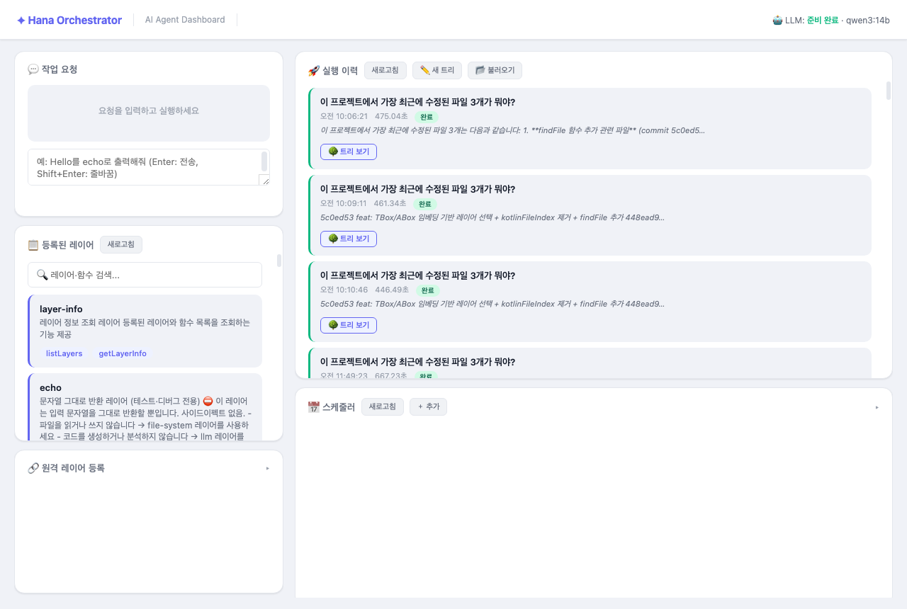

# Hana Orchestrator

**개인 실험 프로젝트** — LLM 기반 AI 오케스트레이션 시스템

> 프로덕션 사용 목적이 아닙니다.



---

## 개요

LLM이 레이어를 조율해 작업을 실행하는 시스템. 핵심 원칙은 두 가지:

1. **LLM 사용 일원화** — 오케스트레이터만 LLM을 사용. 레이어는 LLM 독립적 순수 기능만 수행
2. **레이어 격리** — 레이어는 서로의 존재를 모른다. 조합은 LLM이 결정

---

## 아키텍처

```
사용자 요청
    │
    ▼
┌─────────────────────────────────────────┐
│            Orchestrator                 │
│                                         │
│  ReAct 루프 (DefaultReActStrategy)      │
│  ┌─────────────────────────────────┐    │
│  │  LLM (Ollama)                   │    │
│  │  TBox: 전체 레이어 1줄 요약      │    │  ← 컨텍스트 트리
│  │  ABox: 관련 레이어 상세 스펙     │    │
│  │  {{step:N}}: 과거 결과 lazy 참조 │    │
│  └─────────────────────────────────┘    │
│                                         │
│  ApprovalGate ──── ApprovalPolicy       │
│  (READ_ONLY: 자동 / 그 외: 승인 대기)   │
└────────────────┬────────────────────────┘
                 │
     ┌───────────┼──────────────┐
     ▼           ▼              ▼
┌─────────┐ ┌─────────┐  ┌─────────┐
│ Layer A │ │ Layer B │  │ Layer N │
│ (순수)  │ │ (순수)  │  │ (순수)  │
└─────────┘ └─────────┘  └─────────┘
```

---

## 레이어 레지스트리

| 레이어 | 역할 |
|--------|------|
| `layer-info` | 레이어 목록·상세 조회 |
| `file-system` | 파일 읽기·쓰기·탐색 |
| `git` | branch·commit·diff·stash |
| `build` | compileKotlin·build·restart |
| `shell` | OS-aware 셸 명령 실행 |
| `llm` | LLM 직접 호출 |
| `develop` | 레이어 후보 생성·적용·핫로드 |
| `strategy` | ReAct 전략 후보 생성·핫로드·롤백 |
| `core-evaluation` | RC 후보 비교·평가·적용 |
| `context` | 실행 단위 key-value 저장소 |
| `shared` | @Shared 함수 통합 접근점 |
| `echo` | 디버그용 에코 |
| `text-transformer` | 텍스트 변환 |
| `text-validator` | 텍스트 검증 |

---

## 주요 기능

### ReAct 루프 (기본 실행 모드)

LLM이 스텝별로 미니 트리를 생성하고, 실행하고, 결과를 보고 다음 행동을 결정.

```
요청 → [LLM 판단 → 미니 트리 생성 → 실행 → 결과 확인] × N → finish
```

- 최대 스텝 수 제한으로 무한 루프 방지
- `Structured Outputs` (Ollama `format` 필드): LLM이 `execute_tree` / `finish` 외 포맷 출력 불가
- 히스토리 임계치 초과 시 LLM 요약 압축 (`compressHistory`)

### 컨텍스트 트리 (TBox / ABox)

프롬프트 비대화 방지를 위한 2단계 컨텍스트:

- **TBox** (마스터): 전체 레이어 이름 + 1줄 요약 — 항상 포함
- **ABox** (서브슬롯): 임베딩 기반으로 선택된 관련 레이어 상세 스펙 — 필요한 것만 노출
- **`{{step:N}}`**: 과거 스텝 결과를 `ContextLayer` 슬롯에서 lazy 조회 (대형 결과 프롬프트 제외)

### 자가개선 루프

```
develop.improveLayer()
    → .hana/candidates/ 저장 (원본 보존)
    → [필수후속] 태그로 apply/reject 강제
    → applyLayerCandidate() → compileKotlin 검증 → 성공 시 교체 / 실패 시 .bak 복구
```

- `strategy.createStrategyCandidate()` → `DefaultReActStrategy` 개선 후보 생성
- `strategy.hotLoadStrategy()` → 컴파일 없이 전략 런타임 교체
- 자기 자신(`DevelopLayer`, `DefaultReActStrategy`, `LLMPromptBuilder`)도 개선 대상

### 승인 게이트

레이어의 `approvalPreview().kind`가 정책 결정:

| Kind | 동작 |
|------|------|
| `READ_ONLY` | 항상 자동 통과 |
| `FILE` | unified diff 표시 후 사용자 승인 대기 |
| `EXECUTION` | 실행 내용 표시 후 사용자 승인 대기 |

`scheduledBypass = true`면 모든 게이트 자동 통과 (스케줄러 무인 실행용).

### MCP 서버 (Claude Code 연동)

```bash
claude mcp add --transport sse hana http://localhost:8080/mcp
```

노출 도구:
- `list_layers` — 레이어·함수 목록 조회
- `execute_layer` — 레이어 함수 직접 실행
- `chat` — 오케스트레이터 ReAct 루프 실행

외부 SDK 없음 — Ktor 기반 JSON-RPC 2.0 over SSE (spec 2024-11-05).

### 스케줄러

`.hana/jobs/` JSON 파일로 반복 작업 정의. `scheduledBypass`로 무인 자가개선 루프 실행 가능.

### 인터랙티브 트리 편집기

Cytoscape.js 기반 DAG 시각화. 노드 추가/삭제, Args 편집, LLM 검토, `.hana/trees/`에 저장.

---

## 빠른 시작

### 요구사항

- Java 17+
- [Ollama](https://ollama.com) 설치 및 실행

### 실행

```bash
# 모델 준비
ollama pull qwen3:14b

# 서버 시작
./gradlew run

# Health check
curl http://localhost:8080/health
```

### 기본 사용

```bash
# 작업 실행
curl -X POST http://localhost:8080/chat \
  -H "Content-Type: application/json" \
  -d '{"message": "이 프로젝트에서 가장 최근에 수정된 파일 3개가 뭐야?"}'

# 레이어 직접 실행
curl -X POST http://localhost:8080/layers/file-system/execute \
  -H "Content-Type: application/json" \
  -d '{"function": "listDirectory", "arguments": {"path": "."}}'
```

---

## API 레퍼런스

### Chat

```
POST /chat
Body: { "message": "...", "context": {}, "mode": "reactive" }
```

### Layers

```
GET  /layers                          # 레이어 목록
POST /layers/{name}/execute           # 함수 실행
POST /layers/register-remote          # 원격 레이어 등록
```

### 승인 게이트

```
GET  /approval/pending                # 대기 중 목록
POST /approval/{id}/approve
POST /approval/{id}/reject
```

### 트리

```
POST /tree/review                     # LLM 검토
POST /tree/execute                    # 직접 실행
GET  /trees                           # 저장된 트리 목록
POST /trees/save
GET  /trees/{name}
DELETE /trees/{name}
```

### 스케줄러

```
GET    /jobs
POST   /jobs
PATCH  /jobs/{id}
DELETE /jobs/{id}
POST   /jobs/{id}/trigger
```

### 기타

```
GET  /health
GET  /metrics
GET  /llm-status
POST /shutdown
WS   /ws/executions                   # 실시간 실행 상태
GET  /mcp                             # MCP SSE 스트림
POST /mcp                             # MCP JSON-RPC
```

---

## 프로젝트 구조

```
hana-orchestrator/
├── src/main/kotlin/com/hana/orchestrator/
│   ├── layer/                        # 레이어 구현체
│   │   ├── CommonLayerInterface.kt   # 핵심 인터페이스
│   │   ├── FileSystemLayer.kt
│   │   ├── GitLayer.kt
│   │   ├── BuildLayer.kt
│   │   ├── ShellLayer.kt
│   │   ├── LLMLayer.kt
│   │   ├── DevelopLayer.kt           # 레이어 자가개선 (후보 게이트, 핫로드)
│   │   ├── StrategyLayer.kt          # 전략 생명주기 (핫로드, 롤백)
│   │   ├── CoreEvaluationLayer.kt    # RC 평가·적용
│   │   ├── ContextLayer.kt           # 실행 단위 저장소 (sessionStore / execStore)
│   │   ├── SharedLayer.kt            # @Shared 함수 통합 접근점
│   │   └── LayerFactory.kt
│   ├── orchestrator/
│   │   ├── Orchestrator.kt           # 퍼사드
│   │   ├── ApprovalGate.kt
│   │   ├── ApprovalPolicy.kt         # READ_ONLY / scheduledBypass 정책
│   │   ├── ClarificationGate.kt
│   │   ├── JobScheduler.kt
│   │   └── core/
│   │       ├── ReactiveExecutor.kt   # ReAct 루프
│   │       ├── DefaultReActStrategy.kt  # 기본 전략 (TBox/ABox/압축)
│   │       ├── LayerManager.kt       # 레이어 런타임 관리
│   │       └── TreeExecutor.kt
│   ├── llm/
│   │   ├── LLMPromptBuilder.kt       # TBox / ABox / step 히스토리
│   │   └── strategy/
│   ├── presentation/controller/
│   │   ├── McpController.kt          # MCP SSE + JSON-RPC
│   │   ├── ChatController.kt
│   │   ├── ApprovalController.kt
│   │   └── ...
│   └── Application.kt
├── src/main/resources/static/        # 대시보드 UI
├── buildSrc/                         # KSP 프로세서 (레이어 메타데이터 자동 생성)
├── .hana/
│   ├── candidates/                   # improveLayer() 후보 저장
│   ├── trees/                        # 저장된 실행 트리
│   ├── jobs/                         # 스케줄러 작업 정의
│   └── context/                      # 영구 컨텍스트
└── docs/screenshots/
```

---

## 최근 변경사항

### 2026-05-18

**StrategyLayer 분리** (`DevelopLayer` → `StrategyLayer`)
- 전략 생명주기(후보 생성·핫로드·롤백)를 독립 레이어로 추출
- `HotLoadUtils` 공통 유틸리티로 DRY 적용

**MCP 서버 추가**
- `GET /mcp` SSE 스트림 + `POST /mcp` JSON-RPC
- `claude mcp add --transport sse hana http://localhost:8080/mcp`로 Claude Code 연동

**ContextLayer sessionStore / execStore 분리**
- `layer:*`, `rules:*`, `interface:*` → sessionStore (재시작 전까지 유지)
- 그 외 → execStore (실행 완료 후 자동 정리)

**컨텍스트 트리 구현 완료**
- TBox/ABox 임베딩 기반 레이어 선택
- `{{step:N}}` lazy 슬롯 참조
- `storeStepResult` / `compressHistory`

---

## 기술 스택

| | |
|---|---|
| 언어 | Kotlin |
| 웹 프레임워크 | Ktor 2.3 |
| LLM | Ollama (로컬, 다중 모델) |
| LLM 프레임워크 | ai.koog |
| 직렬화 | kotlinx.serialization |
| 비동기 | kotlinx.coroutines |
| UI | Cytoscape.js |
| 메타데이터 생성 | KSP (Kotlin Symbol Processing) |
| 빌드 | Gradle |

---

## 레이어 추가 방법

```kotlin
class MyLayer : CommonLayerInterface {
    override suspend fun describe() = LayerDescription(
        name = "my-layer",
        description = "...",
        functions = listOf(/* ... */)
    )
    override suspend fun execute(function: String, args: Map<String, Any>): String {
        return when (function) {
            "doSomething" -> /* 순수 기능만, LLM 호출 없이 */
            else -> "Unknown function: $function"
        }
    }
}
// LayerFactory.createDefaultLayers()에 추가
```

레이어 KDoc에 다른 레이어명·함수명 언급 금지 — 조합은 LLM이 결정.

---

MIT License
